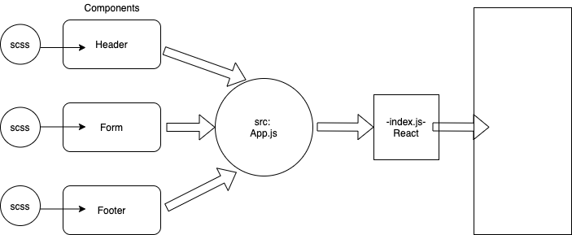
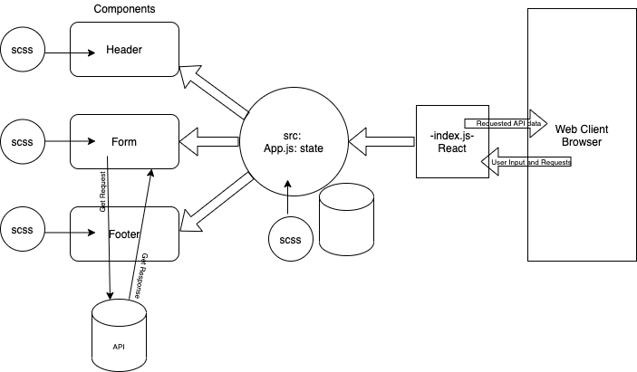

# LAB - Class 26 - 29

## Project: RESTy React App

### Author: Nathan

### Links

- [Deployed on GitHub Pages](https://401-advanced-javascript-nathanrcox.github.io/resty/)

### Resources

- [Getting headers from a React fetch method](https://medium.com/@stevemillerdotdev/getting-response-headers-with-the-javascript-fetch-api-799c83c6480e)

<!-- - [ci/cd](http://xyz.com) (GitHub Actions)
- [back-end server url](http://xyz.com) (when applicable)
- [front-end application](http://xyz.com) (when applicable) -->

### Setup

#### Phase 1 (lab 26) User & Developer Stories

- As a user, I expect an easy-to-read and understandable user interface, so that I can use the application intuitively.
- As a user, I want to enter the URL to a REST API and select the REST method to use to access it.
- As a user, I want visual confirmation that my entries and selections are valid, so that I have confidence the application will be able to fetch the API data that I’ve requested.

---

- As a developer, I want to create a visually appealing site with a header, footer, and a large content area.
- As a developer, I want to create a form that asks for a URL.
- As a developer, I want to create buttons that let the user choose from the REST methods of get, post, put, and delete.
- When the form is filled out and the button is clicked, I want to display the URL and the method chosen.

#### Phase 2 (lab 27) User & Developer Stories

- As a user, I want to enter the URL to an API and issue a GET request so that I can retrieve it’s data.
- As a user, I want to see the results returned from an API request in my browser in a readable format.

#### Phase 3 (lab 28) User & Developer Stories

- As a user, I want to be able to use all four REST methods, so that I can do more than just get data.
- As a user, I want a simple list of all previous queries I’ve run so that I can easily see which queries I’ve run before.
- As a user, I want to click on an old query and have my selections appear in the form for me, so I don’t have to re-type them.
- As a user, I want to see a “loading” indicator while RESTy is fetching data so that I know it’s working on my request.

#### `.env` requirements (where applicable)

<!-- i.e.

- `PORT` - Port Number
- `MONGODB_URI` - URL to the running mongo instance/db -->

#### How to initialize/run your application (where applicable)

`npm start`

#### How to use your library (where applicable)

### Tests

- To run tests, type npm test in the command line from the root directory.
- Any tests of note?
- Describe any tests that you did not complete, skipped, etc.:

### UML

